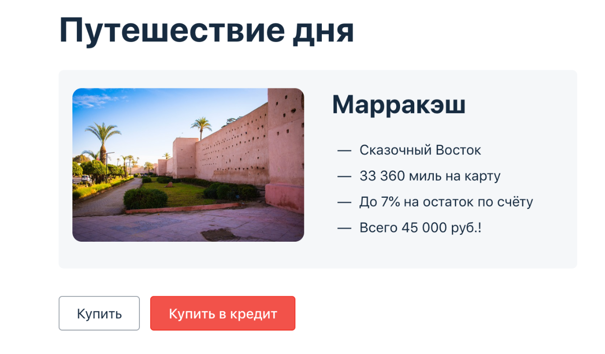
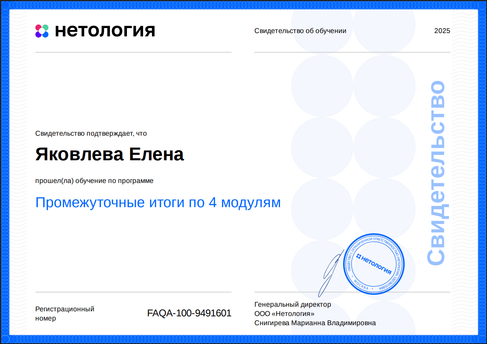

### Курсовой проект по модулю «Автоматизация тестирования» для профессии «Инженер по тестированию»

[Ссылка на задание ](https://github.com/netology-code/aqa-qamid-diplom)

Задача автоматизировать позитивные и негативные сценарии покупки тура. 

#### [План](https://github.com/Elena-Yakovleva/JavaUnitCoursework/blob/main/documents/Plan.md)

#### [Итоги тестирования](https://github.com/Elena-Yakovleva/JavaUnitCoursework/blob/main/documents/Report.md)

#### [Итоги автоматизации](https://github.com/Elena-Yakovleva/JavaUnitCoursework/blob/main/documents/Summary.md)

#### Шаги воспроизведения

**Предусловия**

На ПК необходимо установить ```IntelliJ IDEA Community Edition```, ```Google Chrome```, ```Docker Desktop```

**Установка и запуск**

1. Скачать проект с репозитория на ```GitHub``` с помощью команды в консоли:
```
git clone 
```

2. Запустить сборку контейнеров с помощью команды в консоли:

```
docker compose up
```
3.  ```SUT``` Может работать СУБД  ```MySQL``` и с ```PostgreSQL```. По умолчанию  ```SUT``` работает с ```MySQL```. Для запуска необходимо ввести команду:

```
java -jar .\artifacts\aqa-shop.jar 

```
Для работы через ```PostgreSQL``` необходимо ввести команду:
```
java -jar .\artifacts\aqa-shop.jar --spring.datasource.url=jdbc:postgresql://localhost:5432/app  
или
java -Dspring.datasource.url=jdbc:postgresql://localhost:5432/app -jar artifacts/aqa-shop.jar 

```

Первый вариант - передает аргументы непосредственно приложению Spring Boot через его командную строку, то есть Spring сам интерпретирует эти параметры и применяет их к своей конфигурации.

Второй вариант - конфигурация передается через параметр JVM (-D), который устанавливает значение переменной окружения Spring Boot до запуска приложения.


4. Запуск тестов осуществляется с помощью команды в консоли:

Для ```MySQL```:
```
./gradlew clean test allureServe
```
Для ```PostgreSQL```:
```
./gradlew clean test allureServe -Ddb=jdbc:postgresql://localhost:5432/app

```

5. Просмотр отчета осуществляется с помощью:

```
./gradlew allureServe
```


**Завершение работы**

1. Завершение работы ```SUT``` осуществляется с помощью ввода в консоли ```Ctrl + C```
2. Закрытие и удаление контейнеров в ```Docker Desktop``` осуществляется с помощью команды:
```
docker compose down
```

## Сертификат

