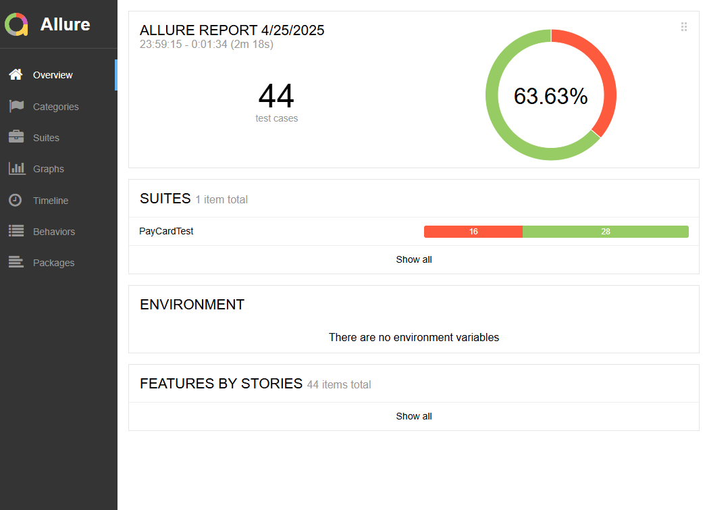

### Отчётные документы по итогам тестирования

#### Краткое описание

В ходе работы проведено тестирование сервиса покупки тура:
* Проведено исследовательское тестирования для знакомства с приложением.
* Проведена автоматизация тестов для покупки тура с помощью карты.
* При развертывании проекта, по умолчанию, подключена СУБД MySQL

#### Количество тест-кейсов
* В ходе тестирования выполнено 44 тест-кейсов
* Количество пройденных автотестов - 28 - 63,63%.
* Количество упавших автотестов - 16 - 36,36%
* По результатам тестов заведено 18 [Issues](https://github.com/Elena-Yakovleva/JavaUnitCoursework/issues)


### Общие рекомендации
* Необходима качественная техническая документация сервиса, в которой полностью определены требования к полям.
* Для упрощения реализации и поддерживания работы автотестов необходимо добавить в элементы страницы тестовые метки ```data-test = " * "```
